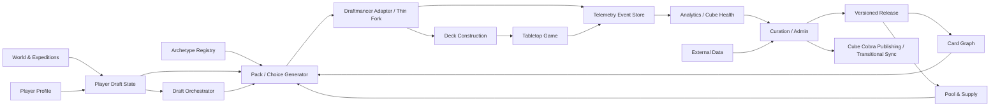

# Gulchdale Systems Map v1.0
Derived companion: [original PDF](../reference/Gulchdale_Systems_Map_v1.0.pdf). Markdown is authoritative.
Status: Original v1.0 design input with later owner amendments.

Current implementation must apply [ADR-0009](../decisions/ADR-0009-new-game-and-integration-boundaries.md):
new packs resolve immediately, shared stages are simultaneous rather than passing,
and new scenes do not inherit legacy UI. Reviewed low-level card primitives may be
adapted. Original passing/rendering ownership recommendations below are superseded
where conflicting. The linked PDF remains the original v1.0 snapshot.
Validation is specified in [the continuation technical proof](../CONTINUATION_TECHNICAL_PROOF.md).
## Architecture principles
- Gulchdale is the source of truth; Cube Cobra and Draftmancer are integrations.
- Gulchdale owns orchestration, state, metadata, weighting, versioning, telemetry, and curation.
- Draftmancer remains the thin multiplayer drafting/rendering engine.
- Private Expedition rewards use a native Choice Pack primitive rather than abusing normal passing boosters.
- All production-affecting content is versioned and published from staging.
- Human curation outranks imported metadata; telemetry informs but does not automatically rebalance the game.
- Player experience and political gameplay outrank fidelity to traditional Commander conventions.

## Overall map

## 1. World & Expeditions

Turns drafting decisions into an adventure. Owns locations, narrative questions, Expedition steps, Adornments, Warbands, Signature Spells, and player-visible consequences.

### Established
- Choices should strongly influence archetypes and may influence tribal, aggro/control/midrange direction.
- Mechanical consequences should be discoverable within roughly 3-5 sessions: neither blatant nor invisible.
- Expeditions may permanently expand color identity for that draft through rewards such as Adornments.
- Current working concept uses more, smaller meaningful stages instead of four very large traditional packs; first instinct is about seven draft stages.
- World and location metadata is categorical and belongs in the Card Graph.

### Recommended v1 default
- Implement Expedition content as data-driven phase definitions, not hard-coded UI flows.
- Introduce a native Choice Pack event: a private 4-8 card generated pool shown to one player; keep the selected card/effect and destroy the remainder.
- Separate narrative text from mechanical effects so wording can change without changing game logic.
- V1 should include only 2-3 locations and one rule-changing reward (Adornment) to prove the system.

### Open questions
- Final number and pacing of intermissions after playtesting.
- Exact first Expedition script and which questions are shared versus player-specific.
- Whether some narrative choices can be mechanically neutral, or every choice must affect weights.
- How many permanent color-expansion effects can exist in one draft.

### Core objects
- ExpeditionDefinition, ExpeditionStep, Choice, ChoiceEffect, LocationTag, Adornment, Warband, SignatureSpell

## 2. Player Profile & Personalization

Stores long-term player tendencies without letting personalization overpower the current Expedition.

### Established
- Accounts are not required for the first public version.
- Players explicitly select an ability level on a simple 1-10 slider.
- An internal, non-exposed metric tracks Gulchdale games played and can be compared with the self-rating.
- Pet-card bias should be mild; approximately 15% increased appearance probability is a reasonable ceiling to test.
- Questionnaire/Expedition signals must dominate personalization, preventing favorites from becoming a self-reinforcing rut.
- Gameplay decisions and outcomes are retained; real personal information is not shared.

### Recommended v1 default
- Create persistent anonymous player IDs first; add authenticated accounts later without changing draft data ownership.
- Store learned preferences as evidence-backed scores with confidence and sample count rather than a single permanent label.
- Allow a player to set an explicit favorite color/archetype later, but preserve learned preferences separately.
- Do not allow mid-draft difficulty changes.

### Open questions
- Exact retention period and deletion/export controls before a public release.
- Whether learned preferences are directly inspectable/editable by players.

### Core objects
- Player, PlayerIdentity, AbilitySelfRating, ExperienceMetric, PreferenceScore, PetCardAffinity, PlayerDraftHistory

## 3. Draft Session & Player Draft State

Owns everything true about a player in the current draft: commanders, leader, colors, current signals, temporary permissions, picks, and phase progress.

### Established
- Players retain all four drafted commanders and mark one as the current Expedition leader.
- Primary color/archetype pivots happen through questionnaires/Expeditions.
- Gulchdale uses strictly one- and two-color commanders.
- Beginner-level players who choose a two-color leader should not normally receive an Adornment.
- Real-time deck-coherence scoring is not desired; recognizing coherence remains a drafting skill.
- Choosing a deliberately harder experience belongs in account/profile settings, not as an in-draft prompt.
- Winning, game count, and post-game feedback may inform the internal ability metric only between games.

### Recommended v1 default
- Model the draft as an explicit state machine rather than a fixed list of booster rounds.
- Snapshot all effective signals before each pack/choice generation so the admin can reconstruct why a card appeared.
- Distinguish permanent-for-draft permissions (Adornment) from temporary phase modifiers.

### Open questions
- Exact ability-level threshold that suppresses Adornments for two-color leaders.
- Whether any question can fully reset an archetype signal rather than merely add/subtract weight.

### Core objects
- DraftSession, DraftPlayerState, LeaderSelection, DraftSignal, TemporaryRule, ColorPermission, PhaseState

## 4. Card Pool & Supply

Defines which cards can exist in a draft, how many virtual copies are available, and which injections are personal/unique.

### Established
- Gulchdale is singleton per final player deck, not singleton across the global draft pool.
- Virtual duplicate supply must scale with player count.
- Tribal archetypes receive targeted personal injections/boosters; the main pool contains support but not necessarily full critical mass.
- Two players may draft the same card into separate singleton decks.
- Commander-specific personal injections can be unique by design (for example Baba Lysaga land package).
- Physical inventory cost is a major constraint; $500 would be exceptional and about $1000 is a more plausible community target.

### Recommended v1 default
- Separate Virtual Supply from Physical Inventory. The engine should first prove gameplay; deployment reports later expose shortages/cost.
- Define copy policies: GLOBAL_UNIQUE, PER_PLAYER_SINGLETON, PLAYER_INJECTION_ONLY, UNLIMITED_EXCEPTION.
- Use player-count scaling rules per pool/archetype, not one global duplicate multiplier.
- Test 4-5 players first while keeping the data model capable of 2-8.

### Open questions
- How tribes remain fair above five players; likely allow each tribe to support two seats or expand the tribe roster.
- Exact pack scaling above four players and how often 16-card passing packs are required.
- Physical-copy reconciliation policy for public/store deployments.

### Core objects
- CardPoolEntry, SupplyPolicy, VirtualCopyCount, PhysicalInventory, PersonalInjection, PlayerCountScalingRule

## 5. Card Graph / Metadata

Describes what each card means to Gulchdale. This is the semantic backbone used by pack generation, curation, analytics, and world choices.

### Established
- V1 metadata: color; macro archetype (Aggro/Control/Midrange and Tribal flag); micro archetypes; primitive difficulty; world/location tags.
- Human overrides outrank imported/derived values and are significant.
- World/location tags are categorical.
- Cards need negative as well as positive relationships (for example Blood Artist: Aristocrats high, Aggro low).

### Recommended v1 default
- Use sparse normalized affinity values where 0.0 = actively anti-synergistic, 0.5 = neutral/default, 1.0 = strong affinity. Missing values resolve to 0.5; do not materialize every card x every dimension row.
- Store raw imported source snapshots separately from derived Gulchdale scores. This preserves provenance, allows re-derivation, and prevents a source refresh from destroying human intent.
- Store human overrides in a separate overlay table with optional reason, author, timestamp, and version.
- Keep categorical tags many-to-many; do not force world tags into numeric affinity unless a location needs a weight.

### Open questions
- Final controlled vocabulary for micro-archetypes and locations.
- Whether card power becomes a required V1 metric or waits for external-data bootstrap.

### Core objects
- Card, CardPrinting, MetadataDimension, CardAffinity, CardTag, SourceSnapshot, DerivedScore, HumanOverride

## 6. Archetypes, Difficulty & Deck Identity

Defines the intentionally supported ways to play Gulchdale, how many seats each can support, and how difficult each is to pilot.

### Established
- Supported archetypes are explicit, hard-coded design commitments maintained in a master registry.
- General target: one drafter is strongly supported; two should be possible with visible scarcity signals; three should feel crowded.
- Mono-color tribes receive dedicated commander/injection infrastructure and high main-pool weights.
- Color count is the largest initial difficulty factor; Control is automatically more difficult; complex commanders can be hand-rated.
- Modern do-everything cards should be heavily scrutinized; lower-cost/simpler cards may reduce archetype overlap.
- Complex cards may remain when the play experience justifies them (Baba Lysaga is an example).

### Recommended v1 default
- Give every archetype a configurable capacity profile: idealSeats, softCap, hardWarning, steeringStrength.
- V1 overcrowding response: reduce further seeding and present a follow-up redirect question. Do not destroy already-drafted cards as an automatic punishment in V1.
- Separate power from pilot difficulty. Difficulty can start with colors, archetype modifier, commander override, and later measured outcomes.

### Open questions
- Per-archetype capacity values (Aggro may support more seats than Control).
- Exact list of launch archetypes and tribes.

### Core objects
- Archetype, ArchetypeCapacity, Tribe, DifficultyProfile, CommanderComplexity, ArchetypeSupportPackage

## 7. Pack Generator & Choice Generator

Creates public passing packs and private Choice Packs from current state, supply, weights, archetype capacity, and controlled randomness.

### Established
- Generation is highly reactive; each decision may curate later pools and multiple pools must be tracked.
- Some stages may be entirely guided while others are intentionally unguided.
- Working overall target: about 35% of the finished draft experience should be entirely random; the remainder may be influenced to varying degrees.
- Full generation tree and weight explanation must be visible to admins but quiet to players.
- Over-seeding into scarce archetypes needs active handling.

### Recommended v1 default
- Use deterministic seeded randomness for reproducible debugging: same release + session seed + state produces the same candidate evaluation.
- Make guidanceStrength a per-phase setting rather than a global rule.
- Record candidate score components, not just final weight.
- Support two primitives: PassingPack and ChoicePack. ChoicePack is private, pick N, destroy remainder, never passes.
- For player-count scaling, configure pack size / discard threshold per phase rather than hard-coding a single 16/8 rule.

### Open questions
- Calibration of random/guided percentage after playtesting.
- Whether overload redirect questions target every player or only players entering the crowded archetype.

### Core objects
- PackDefinition, PassingPack, ChoicePack, CandidateScore, WeightContribution, GenerationTrace, RandomSeed, PoolReservation

## 8. Draft Orchestrator

Coordinates Gulchdale phases above Draftmancer: shared rounds, pauses, questions, private rewards, resumption, and completion.

### Established
- Gulchdale needs questionnaires and Expeditions between drafting stages.
- Private pick-one reward pools are a desired core mechanic.
- The draft should remain one coherent multiplayer session rather than repeatedly closing and rebuilding public sessions.

### Recommended v1 default
- Add this as a first-class Gulchdale service. Do not bury orchestration inside the Draftmancer fork.
- Use a state machine with phase kinds: PASSING_DRAFT, QUESTION, CHOICE_PACK, NARRATIVE, REVIEW, DECK_BUILD.
- Draftmancer is commanded by the orchestrator and reports picks/events back; Gulchdale remains source of truth for phase state.
- Allow admin pause/repair/resume for playtest recovery.

### Open questions
- Exact behavior if one player disconnects during a private question/choice phase.
- Whether all players must complete an intermission before any player can continue.

### Core objects
- DraftPlan, DraftPhase, PhaseTransition, OrchestrationState, PlayerBarrier, AdminRecoveryAction

## 9. Draftmancer Adapter / Thin Fork

Preserves Draftmancer as the multiplayer drafting/rendering engine while exposing the minimum hooks Gulchdale needs.

### Established
- Minimal maintenance and minimal dependence are primary goals.
- If upstream architecture eventually becomes incompatible, Gulchdale is willing to maintain the fork rather than abandon the experience.
- Generic upstream contributions are optional, not a requirement.

### Recommended v1 default
- Pin a known upstream commit and keep a clearly documented patch set.
- Draftmancer already supports per-booster picks/burns/discard rules, draft pause state, personal logs, and custom booster generation; reuse these before inventing replacements.
- Add only narrow hooks: pause/resume; inject/replace pending booster for a player; open/close Gulchdale intermission; inject selected private reward into drafted pool; emit complete pick/seen/pass telemetry.
- Keep Choice Pack rendering in the Gulchdale layer if possible; use Draftmancer card components, not its normal passing-pack lifecycle.
- Run upstream unit, manual statistical, and frontend test suites before accepting upstream merges.

### Open questions
- Exact files to patch after the harness performs a repository audit.
- Whether private Choice Pack UI can reuse client card components without coupling to DraftState.
- Long-term frequency of upstream merges.

### Core objects
- DraftmancerAdapter, UpstreamRevision, PatchManifest, CompatibilityTest, DraftmancerEventBridge

## 10. Deck Construction & Game

Defines the post-draft playable object and captures game outcomes without trying to simulate actual tabletop Magic.

### Established
- 30 starting life.
- Final deck size is 60 cards: target 36 spells and 24 lands.
- All four drafted commanders remain available after the draft; one is marked leader.
- An Adornment communicates an off-color permission and currently exists physically as a draftable extra card; current tabletop practice can be preserved while digital rules become explicit.
- Draftmancer mana-base recommendations may remain even though non-basic-land handling is limited.
- Initial game results are entered by an admin/Game Master: winner, mana/color screw, archetype failures/successes/discoveries, fun/not-fun, and other observations.

### Recommended v1 default
- Model Adornment permission explicitly in deck validation even if the physical Adornment remains a 61st reference card.
- Add a lightweight post-game player questionnaire later: game too long, oppressive threat, MVP, deck fun.
- Do not attempt sentence-level AI analysis in V1; store optional notes for later review.

### Open questions
- Whether multiple commanders can be used in-command-zone during a game or only the marked leader (Charter currently defines availability, not exact game rule).
- Exact legal role of the physical Adornment card in digital deck counts.

### Core objects
- Deck, DeckCard, CommanderOption, SelectedLeader, DeckPermission, GameRecord, PostGameFeedback

## 11. Telemetry & Event Store

Creates an immutable history of what the system showed, what players did, and which version of Gulchdale produced the experience.

### Established
- Cards seen but passed must be tracked, not only picks.
- Cube versions need major/minor concepts; major reconstruction may invalidate or flatten some learned metadata while minor changes can often continue.
- Post-game questions of interest include game length, oppressive threats, MVP, and deck fun.
- Low enjoyment and excessive game-length feedback attached to archetypes are important unhealthy-archetype signals.

### Recommended v1 default
- Mandatory events in V1: session created, release/version IDs, phase start/end, pack generated, candidates + weight trace, card seen, pick, pass, burn/discard, question shown/answered, reward granted, deck submitted, admin result entry.
- Use append-only event records plus derived read models; do not overwrite historical draft facts.
- Every draft stores immutable IDs/hashes for Pool Release, Metadata Release, Rules Release, and Engine Build. Historical analysis never reinterprets an old draft using today's metadata.
- Use semantic-ish releases: MAJOR = structural rules/pool reset; MINOR = compatible curation/content change; PATCH = metadata/text/config correction.

### Open questions
- Exact policy for carrying player preference evidence across a MAJOR release.
- Which events are retained indefinitely for a public deployment.

### Core objects
- TelemetryEvent, DraftEvent, GenerationTraceEvent, ReleaseSnapshot, GameFeedback, DerivedMetric

## 12. Analytics & Cube Health

Converts telemetry into signals for humans; it advises curation but does not automatically rebalance Gulchdale.

### Established
- Overlooked cards matter and should be discoverable from seen-vs-picked data.
- Low fun, overlong games, and negative feedback associated with an archetype are health signals.
- Analytics should support cube-health and player-tendency study.

### Recommended v1 default
- V1 dashboard metrics: card seen/pick rate, pick position, final-deck inclusion, archetype occupancy, archetype fun, color screw, game length, oppressive-card flags, leader choice rate, choice-path frequency.
- Never auto-remove cards from production from analytics alone. Create recommendations/flags for curator review.
- Add confidence/sample-size display to avoid acting on three games as if they were thirty.

### Open questions
- Formal thresholds for unhealthy cards/archetypes after enough playtest data exists.
- How win rate should be weighted versus fun and political quality.

### Core objects
- CardHealthMetric, ArchetypeHealthMetric, PlayerTendencyMetric, HealthFlag, AnalyticsSnapshot

## 13. Curation, Admin, Staging & Rollback

Becomes the long-term primary interface for maintaining Gulchdale: card list, metadata, archetypes, releases, imports, playtest notes, and rollback.

### Established
- Live and staging/beta pools are required.
- Rollback should be deliberately easy for an admin but protected by strong confirmation.
- Plane should ideally have circular interaction with the app over time.
- Cube Cobra is currently the primary curation interface, so migration must be gradual.

### Recommended v1 default
- No direct edits to LIVE. All curation edits occur in STAGING; Publish creates an immutable release; rollback moves the live pointer to a prior release.
- All production-affecting changes are versioned. Reasons are required for high-impact overrides/removals, optional for routine metadata cleanup.
- V1 migration: import Cube Cobra as an upstream list source and detect when Cube Cobra is ahead. Later, invert the relationship so Gulchdale exports to Cube Cobra.
- Plane integration begins as deep links/ticket IDs stored on changes, not automatic ticket mutation.

### Open questions
- When Gulchdale becomes authoritative for card-list edits instead of Cube Cobra.
- Which change types require a second human review once delegation exists.

### Core objects
- StagingWorkspace, CurationChange, Release, Rollback, AuditEntry, PlaneReference, CubeCobraSyncStatus

## 14. External Data & Publishing Integrations

Imports external information intentionally and publishes selected Gulchdale views without making runtime gameplay depend on outside services.

### Established
- External metadata is never silently refreshed in production.
- Refresh occurs on explicit admin command and/or release work; automatic checks may only flag that a source value changed.
- If a source disappears or changes schema, raise a flag; an admin may reconcile or intentionally protect/ignore the existing snapshot.
- Cube Cobra may need to inform V1 when its list is ahead.
- Game-store deployment is not a V1/V2 requirement.

### Recommended v1 default
- Every importer is snapshot -> parse -> validate -> diff -> admin review -> promote. Runtime drafts read only promoted Gulchdale data.
- Adapters should be replaceable and failures isolated by source.
- Publishing outputs should eventually include Cube Cobra export, Draftmancer-compatible export/debug file, card manifest, and build-cost report.

### Open questions
- Exact rights/terms policy per external data source before automated distribution.
- Final Cube Cobra write-back method and whether it remains one-way.

### Core objects
- ExternalSource, ImportSnapshot, ImportDiff, ImportFlag, PublishedArtifact, CubeCobraAdapter

## 15. Productization, Buildability & Portability

Makes Gulchdale reproducible outside the original playgroup without forcing those constraints into the core V1 game engine.

### Established
- Community build target: approximately $500 would be excellent; around $1000 is considered plausible.
- Manabase is the major cost problem; spells are generally inexpensive.
- A future store might run Gulchdale locally or use a hosted server; dedicated computers/tablets may be preferable to phones.
- Game-store deployment is a stretch goal, not V1 or likely V2.

### Recommended v1 default
- Track cost/buildability metadata early, but defer store workflows.
- Generate shopping manifests from an immutable Pool Release so a physical build corresponds to software content.
- Eventually support a Community Build profile that swaps expensive printings/cards while preserving archetype role.

### Open questions
- What local-operator settings are safe to expose without breaking design assumptions.
- How many physical devices a store deployment should assume.

### Core objects
- BuildProfile, CardCostSnapshot, ReplacementCandidate, ShoppingManifest, DeploymentProfile

## 16. Project Operations & Toolchain

Connects architecture decisions to executable work in the new development environment.

### Established
- The development environment includes an AI Harness, Plane ticketing, Outline documentation, a GitHub repository, and MailPit.
- AI assistance is expected across every project role where useful.

### Recommended v1 default
- Outline is the canonical human-readable design/decision record: Charter, Systems Map, ADRs, rules, data dictionary, playtest reports.
- Plane is the execution backlog: Epics map to systems/phases; tickets link to Outline decisions and GitHub branches/PRs.
- GitHub is the canonical source repository and release history; protected main, feature branches, CI, tagged releases.
- Harness executes Plane work against documented acceptance criteria; it must not invent game-design decisions when an OPEN item blocks implementation.
- MailPit is local/test email capture only (account invites, resets, post-draft questionnaires); no production delivery dependency.
- Every significant architecture change gets an ADR in Outline and a linked Plane ticket/PR.

### Open questions
- Exact CI/CD target and staging host.
- Whether Plane/Outline/GitHub connectors are automated in the first engineering phase or kept as disciplined links initially.

### Core objects
- ArchitectureDecisionRecord, PlaneEpic, PlaneTicket, GitHubPullRequest, BuildArtifact, TestEmail

# Development phases

## Phase 0 - Preserve, Audit, and Establish Guardrails
- Freeze/snapshot current Gulchdale exporter, current Draftmancer custom list, current landing/draft flow, and current Cube Cobra identifiers.
- Import the Design Charter and this Systems Map into Outline as canonical design docs.
- Create Plane epics, branch strategy, CI baseline, local dev bootstrap, and ADR template.
- Fork/pin Draftmancer at a known upstream commit; do not modify it yet.
- Capture a legacy end-to-end smoke test so the overhaul can always prove what it replaced.

**Exit criterion:** Done when a new developer/Harness can clone, boot, run tests, and reproduce the legacy draft without hidden manual steps.

## Phase 1 - Gulchdale Data Foundation
- Create the Gulchdale database and release/version model.
- Import the current Cube Cobra pool into staging and preserve card IDs/printing references.
- Add Card Pool/Supply, Card Graph, Archetype Registry, World tags, commanders, personal injections, and human override structures.
- Implement explicit external-source snapshots and manual refresh/diff workflow.
- Build read-only admin views before edit workflows.

**Exit criterion:** Done when Gulchdale can represent the current cube plus metadata independently of Draftmancer/Cube Cobra.

## Phase 2 - Pack Generator as a Standalone Simulator
- Implement PassingPack and ChoicePack generation with seeded randomness.
- Implement weighted score composition, neutral/anti-synergy behavior, player-count scaling, supply reservation, and admin explain traces.
- Implement archetype capacity and V1 crowding behavior (reduce seed + redirect question flag).
- Build simulation commands/tests that generate thousands of packs without a browser.
- Start with a small curated test slice before tagging the full pool.

**Exit criterion:** Done when admins can explain exactly why every candidate entered a generated pack and replay it from the seed.

## Phase 3 - Draft Orchestrator and Narrative Engine
- Implement the phase state machine and data-driven Expedition definitions.
- Support QUESTION, NARRATIVE, PASSING_DRAFT, CHOICE_PACK, REVIEW, and DECK_BUILD phases.
- Implement leader marking among four retained commanders and temporary/permanent-for-draft modifiers.
- Implement one location choice and one Adornment flow.
- Add admin pause/repair/resume tools.

**Exit criterion:** Done when a simulated player can complete a multi-stage Expedition without Draftmancer.

## Phase 4 - Thin Draftmancer Integration
- Audit Draftmancer Session/DraftState/client card UI and identify the minimum patch surface.
- Reuse existing picks/burns/discard/pause behavior for ordinary passing stages.
- Add the event bridge, dynamic pack handoff, intermission pause/resume, and private Choice Pack integration.
- Keep Gulchdale state authoritative; Draftmancer owns rendering/passing/network synchronization only.
- Run Draftmancer upstream unit/manual/frontend tests in CI; add Gulchdale compatibility tests.

**Exit criterion:** Done when a real 4-player browser session can pause for a Gulchdale question/choice and resume without losing draft state.

## Phase 5 - First Playable Vertical Slice
- Target 4 players first (architecture remains 2-8 capable).
- Commander round: each player ultimately retains four commanders, then privately marks one leader.
- Run at least two meaningful questions and one private Choice Pack.
- Finish enough draft material to build a 60-card deck; retain mana-base helper; enforce current Gulchdale permissions.
- Record complete telemetry and allow admin post-game result entry.
- Playtest repeatedly before expanding content breadth.

**Exit criterion:** Done when this new flow is more fun/useful than the legacy four-pack draft for a real playgroup.

## Phase 6 - Curation UI, Staging, Publish, and Rollback
- Build staging edits for pool, metadata, archetypes, questions, and injections.
- Publish immutable releases; live drafts select a release; add the big red rollback action with confirmations.
- Implement Cube Cobra import/ahead detection as a transitional workflow.
- Attach Plane ticket/Outline ADR references to impactful changes.
- Add release diff viewer.

**Exit criterion:** Done when routine curation no longer requires editing source files and production can be rolled back safely.

## Phase 7 - Telemetry, Cube Health, and Playtest Analytics
- Build card seen/passed/picked dashboards and final-deck inclusion tracking.
- Add archetype occupancy/crowding, fun score, game length, color screw, oppressive threat, and MVP views.
- Add sample-size/confidence warnings and admin flags rather than automatic rebalancing.
- Generate version-aware playtest reports.

**Exit criterion:** Done when curation meetings can be driven by actual draft/game evidence without losing qualitative judgment.

## Phase 8 - Persistent Player Learning (Optional Accounts)
- Persist anonymous player identity across sessions where possible.
- Implement ability slider + internal experience metric.
- Learn preferences and pet-card affinity with evidence/confidence.
- Cap pet-card influence around the mild ~15% test target and keep Expedition signals dominant.
- Add authenticated accounts only when persistence, privacy, and recovery are worth the added scope.

**Exit criterion:** Done when repeat players feel recognizable to Gulchdale without the system railroading them.

## Phase 9 - Advanced Gulchdale Systems
- Expand locations, Warbands, Signature Spells, tribe packages, color-opening rules, and player-specific questions.
- Experiment with more sophisticated archetype crowding/territory conflicts only after V1 data exists.
- Improve non-basic mana recommendations and difficulty estimation if playtests justify it.
- Add multiple draft modes while keeping one shared Card Graph and telemetry model.

**Exit criterion:** Done when new game modes are data/config extensions rather than forks of core logic.

## Phase 10 - Buildability and External Deployment
- Cost snapshots, replacement suggestions, shopping manifests, Community Build profile.
- Evaluate 6-8 player physical supply requirements and store/device workflows.
- Harden hosting, operator configuration, backups, privacy, and support docs.
- Treat commercial/licensing strategy as a separate product/legal workstream.

**Exit criterion:** Done when another operator can reproduce a specific Gulchdale release without the original creator present.

# Initial Plane epic structure
- GD-000 Architecture & Legacy Baseline
- GD-100 Data Foundation & Releases
- GD-200 Card Graph & External Data
- GD-300 Pack Generator & Simulation
- GD-400 Draft Orchestrator & Expeditions
- GD-500 Draftmancer Adapter
- GD-600 Admin / Curation / Publishing
- GD-700 Telemetry & Analytics
- GD-800 Player Personalization
- GD-900 Deployment / Buildability

# Harness guardrails
- Do not redesign unresolved game rules silently. Create a Plane ticket / Outline ADR when an OPEN decision blocks implementation.
- Keep Draftmancer patches minimal and documented against a pinned upstream revision.
- Never make runtime drafting depend on live EDHREC/Cube Cobra/Scryfall availability; use promoted snapshots.
- All random generation must be reproducible from stored seeds and release IDs.
- No direct production edits: staging -> diff/review -> publish -> immutable release.
- Telemetry is append-only factual history; derived metrics may be rebuilt.
- Prefer an end-to-end playable vertical slice over broad unfinished infrastructure.
